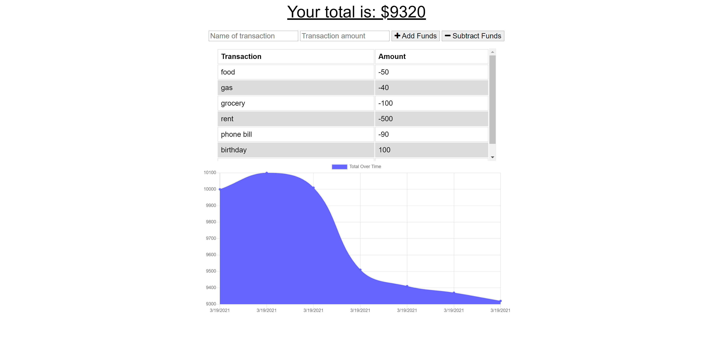

# budget-tracker

## Description

In this project I added functionality to a budget tracker that would allow the user access when offline.

## Installations
Run npm i

For this project compression, express, lite-server, mongoose, and morgan were used.

## Questions
If you have any questions contact me at mrivera0014@gmail.com.
Find more of my work at (https://github.com/mrivera0014/)

## Screenshots

## Links

[Link to Github repository](https://github.com/mrivera0014/budget-tracker)
 

[Link to deployed application ](https://vast-peak-63843.herokuapp.com/)